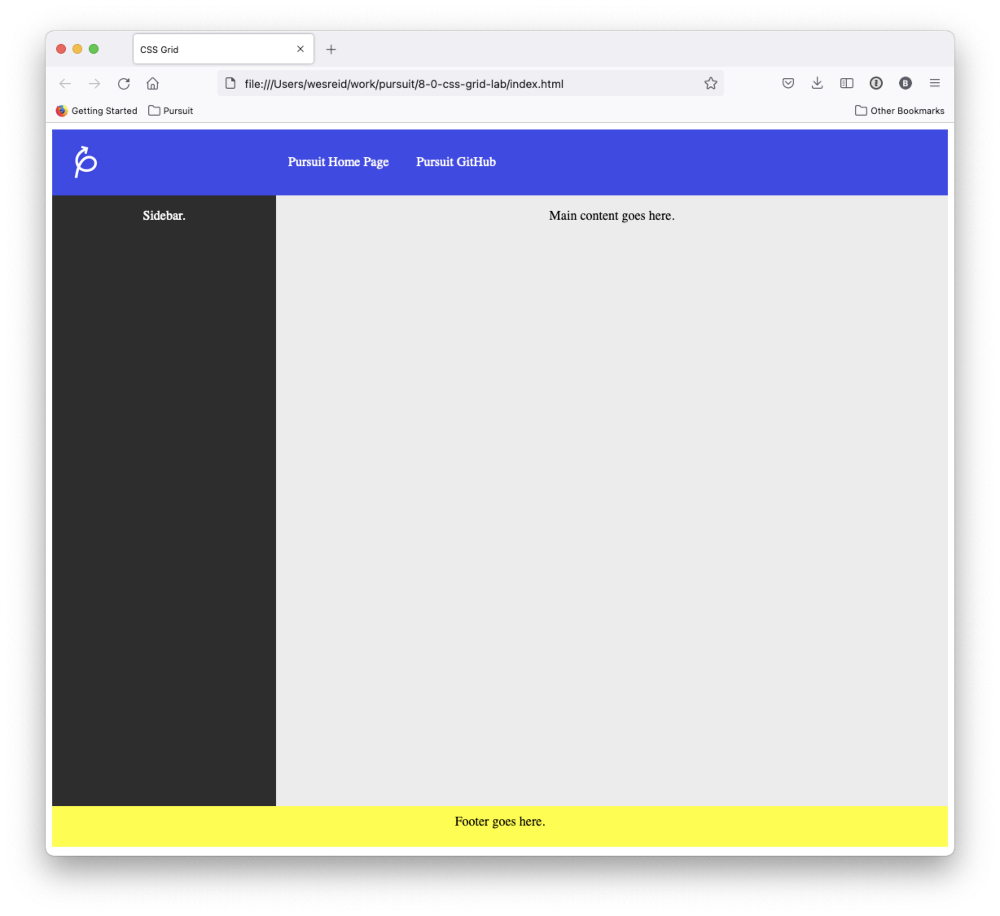

# CSS Grid Lab

In this lab, you will use CSS Grid to structure a webpage. If you're stuck, you may want to visit the following website which can be of help.

- [CSS-Tricks: A Complete Guide to Grid](https://css-tricks.com/snippets/css/complete-guide-grid/)

## Lab Setup

### Getting started

1. Fork and clone this repository.

1. Open up the repository in VSCode. Follow the instructions below to complete the Lab.

### Tests

There are no tests for this lab. Instead, make sure that what you build looks like the mockup below.

## Instructions

Style the HTML in the `index.html` file so that it looks like the content below.

You _should not_ need to change any of the HTML. Instead, focus on adding to the `style.css` file.

Use CSS Grid when organizing the content on the page.

## Submission and Grading

You will host the results of this lab on GitHub Pages (please see the guide to hosting on GitHub pages for detailed instructions).

You need to edit this file to include the link for your instructors.

**ADD link to your GitHub Pages Here**

Your instructor will use a combination of reading your code and viewing the results of your code to determine a grade.
